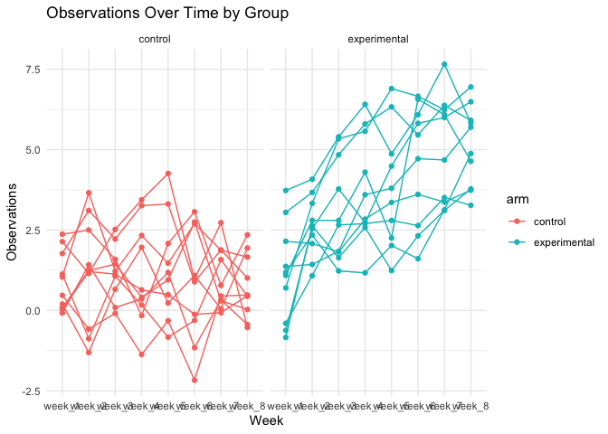

p8105_hw5_zj2379
================
Zheshu Jiang
2023-11-12

## Problem 1

``` r
library(tidyverse)
```

    ## ── Attaching core tidyverse packages ──────────────────────── tidyverse 2.0.0 ──
    ## ✔ dplyr     1.1.3     ✔ readr     2.1.4
    ## ✔ forcats   1.0.0     ✔ stringr   1.5.0
    ## ✔ ggplot2   3.4.3     ✔ tibble    3.2.1
    ## ✔ lubridate 1.9.2     ✔ tidyr     1.3.0
    ## ✔ purrr     1.0.2     
    ## ── Conflicts ────────────────────────────────────────── tidyverse_conflicts() ──
    ## ✖ dplyr::filter() masks stats::filter()
    ## ✖ dplyr::lag()    masks stats::lag()
    ## ℹ Use the conflicted package (<http://conflicted.r-lib.org/>) to force all conflicts to become errors

``` r
# Create a city_state variable
homicide_df = read.csv("./homicide-data.csv")|>
 mutate(city_state = paste(city, state, sep = ", "))

#summarize within cities to obtain the total number of homicides and the number of unsolved homicides 
homicide_df1=homicide_df |>
  group_by (city) |>
  summarize(total_homicides=n(),
            unsolved_homicides=sum(disposition %in% c("Closed without arrest","Closed by arrest")))
homicide_df1
```

    ## # A tibble: 50 × 3
    ##    city        total_homicides unsolved_homicides
    ##    <chr>                 <int>              <int>
    ##  1 Albuquerque             378                284
    ##  2 Atlanta                 973                658
    ##  3 Baltimore              2827               1154
    ##  4 Baton Rouge             424                244
    ##  5 Birmingham              800                517
    ##  6 Boston                  614                304
    ##  7 Buffalo                 521                210
    ##  8 Charlotte               687                525
    ##  9 Chicago                5535               1849
    ## 10 Cincinnati              694                434
    ## # ℹ 40 more rows

For the city of Baltimore, MD, use the prop.test function to estimate
the proportion of homicides that are unsolved; save the output of
prop.test as an R object, apply the broom::tidy to this object and pull
the estimated proportion and confidence intervals from the resulting
tidy dataframe.

``` r
baltimore_homicides <- homicide_df %>%
  filter(city == "Baltimore", state == "MD")

# Use prop.test to estimate the proportion of unsolved homicides
unsolved_homicides <- sum(baltimore_homicides$disposition %in% c("Closed without arrest", "Open/No arrest"))
total_homicides <- nrow(baltimore_homicides)

prop_test_result <- prop.test(unsolved_homicides, total_homicides)

# Tidy the result of prop.test using broom::tidy
tidy_prop_test <- broom::tidy(prop_test_result)

# Pull the estimate and confidence intervals
tidy_estimate_ci <- tidy_prop_test %>%
  select(estimate, conf.low, conf.high) %>%
  pull()
```

``` r
# Create a summary dataframe with counts of unsolved and total homicides by city
city_summary <- homicide_df %>%
  group_by(city, state) %>%
  summarise(
    unsolved_homicides = sum(disposition %in% c("Closed without arrest", "Open/No arrest")),
    total_homicides = n(),
    .groups = "drop"
  )

# Use purrr to apply prop.test to each city and tidy the results
tidy_prop_test_results <- city_summary %>%
  mutate(
    prop_test = map2(unsolved_homicides, total_homicides, ~prop.test(.x, .y)),
    tidy_results = map(prop_test, broom::tidy)
  ) %>%
  select(city, state, tidy_results) %>%
  unnest(tidy_results)
```

    ## Warning: There was 1 warning in `mutate()`.
    ## ℹ In argument: `prop_test = map2(unsolved_homicides, total_homicides,
    ##   ~prop.test(.x, .y))`.
    ## Caused by warning in `prop.test()`:
    ## ! Chi-squared approximation may be incorrect

``` r
tidy_proportions_ci <- tidy_prop_test_results %>%
  select(city, state, estimate, conf.low, conf.high)
tidy_proportions_ci
```

    ## # A tibble: 51 × 5
    ##    city        state estimate conf.low conf.high
    ##    <chr>       <chr>    <dbl>    <dbl>     <dbl>
    ##  1 Albuquerque NM       0.386    0.337     0.438
    ##  2 Atlanta     GA       0.383    0.353     0.415
    ##  3 Baltimore   MD       0.646    0.628     0.663
    ##  4 Baton Rouge LA       0.462    0.414     0.511
    ##  5 Birmingham  AL       0.434    0.399     0.469
    ##  6 Boston      MA       0.505    0.465     0.545
    ##  7 Buffalo     NY       0.612    0.569     0.654
    ##  8 Charlotte   NC       0.300    0.266     0.336
    ##  9 Chicago     IL       0.736    0.724     0.747
    ## 10 Cincinnati  OH       0.445    0.408     0.483
    ## # ℹ 41 more rows

``` r
tidy_proportions_ci <- tidy_proportions_ci %>%
  arrange(desc(estimate))
plot <- ggplot(tidy_proportions_ci, aes(x = reorder(city, estimate), y = estimate)) +
  geom_point() +
  geom_errorbar(aes(ymin = conf.low, ymax = conf.high), width = 0.2) +
  coord_flip() +  # Flip the axes to make the plot horizontal
  labs(x = "City", y = "Proportion of Unsolved Homicides", title = "Proportion of Unsolved Homicides by City") +
  theme_minimal()

ggsave(filename = "unsolved_homicides_by_city.png", plot = plot, width = 10, height = 8, dpi = 300)
```

## Problem 2

Create a tidy dataframe containing data from all participants, including
the subject ID, arm, and observations over time:

Start with a dataframe containing all file names; the list.files
function will help Iterate over file names and read in data for each
subject using purrr::map and saving the result as a new variable in the
dataframe Tidy the result; manipulate file names to include control arm
and subject ID, make sure weekly observations are “tidy”, and do any
other tidying that’s necessary Make a spaghetti plot showing
observations on each subject over time, and comment on differences
between groups.

``` r
# Get the list of file names
file_names <- list.files(path = "./data", pattern = "*.csv")
file_names
```

    ##  [1] "con_01.csv" "con_02.csv" "con_03.csv" "con_04.csv" "con_05.csv"
    ##  [6] "con_06.csv" "con_07.csv" "con_08.csv" "con_09.csv" "con_10.csv"
    ## [11] "exp_01.csv" "exp_02.csv" "exp_03.csv" "exp_04.csv" "exp_05.csv"
    ## [16] "exp_06.csv" "exp_07.csv" "exp_08.csv" "exp_09.csv" "exp_10.csv"

``` r
# write a function to extract subject id, and arm from the file names
extract_info <- function(filename) {
  subject_id <- str_extract(filename, "\\d+")
  arm <- if_else(str_detect(filename, "^con"), "control", "experimental")
  return(tibble(subject_id = subject_id, arm = arm))
}
info_list <- map(file_names, extract_info)
subject_info <- bind_rows(info_list)
# Print the resulting data frame
print(subject_info)
```

    ## # A tibble: 20 × 2
    ##    subject_id arm         
    ##    <chr>      <chr>       
    ##  1 01         control     
    ##  2 02         control     
    ##  3 03         control     
    ##  4 04         control     
    ##  5 05         control     
    ##  6 06         control     
    ##  7 07         control     
    ##  8 08         control     
    ##  9 09         control     
    ## 10 10         control     
    ## 11 01         experimental
    ## 12 02         experimental
    ## 13 03         experimental
    ## 14 04         experimental
    ## 15 05         experimental
    ## 16 06         experimental
    ## 17 07         experimental
    ## 18 08         experimental
    ## 19 09         experimental
    ## 20 10         experimental

``` r
# write a function to read observations
read_obs <- function(file_path) {
  df <- read_csv(file_path, show_col_types = FALSE)
  observations_list <- as.list(df[,1])
  observations_list <- lapply(observations_list, as.numeric)
  return(observations_list)
}
 
# use map to read multiple files
file_paths <- list.files(path = "./data", pattern = "*.csv", full.names = TRUE)
data=read_csv(file_paths)
```

    ## Rows: 20 Columns: 8
    ## ── Column specification ────────────────────────────────────────────────────────
    ## Delimiter: ","
    ## dbl (8): week_1, week_2, week_3, week_4, week_5, week_6, week_7, week_8
    ## 
    ## ℹ Use `spec()` to retrieve the full column specification for this data.
    ## ℹ Specify the column types or set `show_col_types = FALSE` to quiet this message.

``` r
combine=bind_cols(subject_info, data)
combine_long <- combine %>%
  pivot_longer(
    week_1:week_8,
    names_to = "week",
    values_to = "observations_over_time"
  )
  combine_long
```

    ## # A tibble: 160 × 4
    ##    subject_id arm     week   observations_over_time
    ##    <chr>      <chr>   <chr>                   <dbl>
    ##  1 01         control week_1                   0.2 
    ##  2 01         control week_2                  -1.31
    ##  3 01         control week_3                   0.66
    ##  4 01         control week_4                   1.96
    ##  5 01         control week_5                   0.23
    ##  6 01         control week_6                   1.09
    ##  7 01         control week_7                   0.05
    ##  8 01         control week_8                   1.94
    ##  9 02         control week_1                   1.13
    ## 10 02         control week_2                  -0.88
    ## # ℹ 150 more rows

Make a spaghetti plot showing observations on each subject over time,
and comment on differences between groups.

``` r
plot1<-ggplot(combine_long, aes(x = week, y = observations_over_time, group = subject_id, color = arm)) +
  geom_line() +  # draw lines for each subject
  geom_point() +  # add points for observations
  theme_minimal() +  
  facet_grid(. ~ arm) +
  labs(title = "Observations Over Time by Group",
       x = "Week",
       y = "Observations") 
plot1
```

<!-- -->

``` r
ggsave("observations_over_time_by_group.png", plot1, width = 10, height = 6, dpi = 300)
```

Based on the graph, the experimental group has higher values of
observations over time than that of the control group. The experimental
group seems to start with lower observation values compared to the
control group but increases steadily over time.The control group’s
observations fluctuate around a certain range without a clear trend of
increase or decrease over the eight weeks; in contrast, experimental
group’s observations increase as time progresses.

# Problem 3

write a function to get the outputs of t test

``` r
set.seed(1234)

sim <- function(n = 30, mu, sigma = 5){
  x = rnorm(n, mean = mu, sd = sigma)
  test <- t.test(x = x, alternative = "two.sided", conf.level = 0.95) |>
    broom::tidy() |>
    select(estimate, p.value)
}
```

first, let mu=0 and generate 5000 datasets

``` r
sim_mu_0 <- map_df(1:5000, ~sim(mu = 0))|>
  bind_rows()
```
